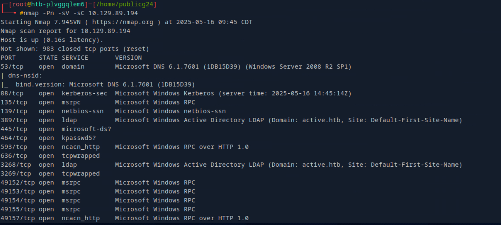

# CICADA

## Topics will be covered
   - Active Directory Enumeration and Privilege Escalation
   - Password Spraying
   - SeBackup Privilege Abuse
   - Pass-the-Hash Attack

## Enumeration and Exploitation tools :
- Nmap
- SMB
- Lookupsid
- Password Spraying 
- Enumerating Domain Users 
- Foothold
- Privilege Escalation 


### Nmap
--------------------------------------------------------------------------------
```bash
nmap -sV -Pn 10.10.11.35
```
Findings
- Kerberos (port 88)
- LDAP/S (ports 389, 636, 3268, 3269)
- Domain: cicada.htb
- Host: CICADA-DC.cicada.htb

* Note: As there is no web interface, the first thing we can check is the SMB shares.

### SMB shares
-----------------------------------------------------------------------------------------
```bash
crackmapexec - a popular tool to automate enumerating domains (including users, files/ directories, and shares)
```

Note : if we specify any user the results would be much more better
Lets take guest as user and no password.
```bash
crackmapexec smb cicada.htb -u 'guest' -p '' --shares
```
