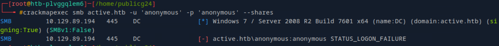

# CICADA

## Topics will be covered
   - Active Directory Enumeration and Privilege Escalation
   - Password Spraying
   - SeBackup Privilege Abuse
   - Pass-the-Hash Attack

## Enumeration and Exploitation tools :
- Nmap
- SMB
- Lookupsid
- Password Spraying 
- Enumerating Domain Users 
- Foothold
- Privilege Escalation 


### Nmap
--------------------------------------------------------------------------------
```bash
nmap -sV -Pn 10.10.11.35
```
Findings
- Kerberos (port 88)
- LDAP/S (ports 389, 636, 3268, 3269)
- Domain: cicada.htb
- Host: CICADA-DC.cicada.htb

** Note: As there is no web interface, the first thing we can check is the SMB shares.

### SMB shares
-----------------------------------------------------------------------------------------
```bash
crackmapexec - a popular tool to automate enumerating domains (including users, files/ directories, and shares)
```

Note : if we specify any user the results would be much more better
Lets take guest as user and no password.
```bash
crackmapexec smb cicada.htb -u 'guest' -p '' --shares
```

- We can see HR share and IPC$ shares are able to read by guest user.
--------------------------------------------------------------------------------------------------------------------
### Smbclient
```bash
smbclient  //cicada.htb/HR
```

- Let's get the notice from HR.txt to kali

- And lets try reading what's inside the note---it seems we have default password for 1st time login 


----------------------------------------------------------------------------------------------------------------------
### Impackets - Impacket is an open-source toolkit
- Common Attacks & Exploits
|Use Case|Tool/Script|Description|
| :---         |     :---:      |          ---: |
|Pass-the-Hash (PtH)|psexec.py, wmiexec.py|Executes commands using NTLM hashes.|
|Pass-the-Ticket (PtT)|ticketConverter.py|Uses Kerberos tickets for lateral movement.|
|SMB Relay Attack|ntlmrelayx.py|Relays NTLM auth to other machines.|
|DCSync Attack|secretsdump.py|Extracts password hashes from Active Directory.|
|Golden Ticket Attack|ticketer.py|Forges Kerberos tickets for persistence.|
|lookupsid|impacket-lookupsid|To get the user|

### Post-Exploitation & Enumeration

| Tool          | Purpose                                   |
|---------------|-------------------------------------------|
| GetADUsers.py | Dumps AD user info via LDAP.             |
|smbclient.py   | Interacts with SMB shares (like smbclient).|
| smbmap.py     | Enumerates SMB shares and permissions.    |  
| mssqlclient.py | Executes SQL queries on MSSQL servers. |
| rpcdump.py     | Lists RPC endpoints on a target.         |


