#  Covfefe1
----------------------------
Machine name : Covfee1 
Testing Methodology 
1. Reconnaissance & Enumeration 
     Port Scanning 
     Port 80: HTTP (nginx) 

     Port 31337 

     Directory Enumeration 

2. Web Application Analysis 

3.Gaining Initial Access 
    Cracking SSH Key 
    Establishing SSH Connection: 
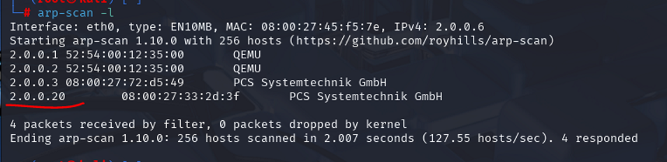
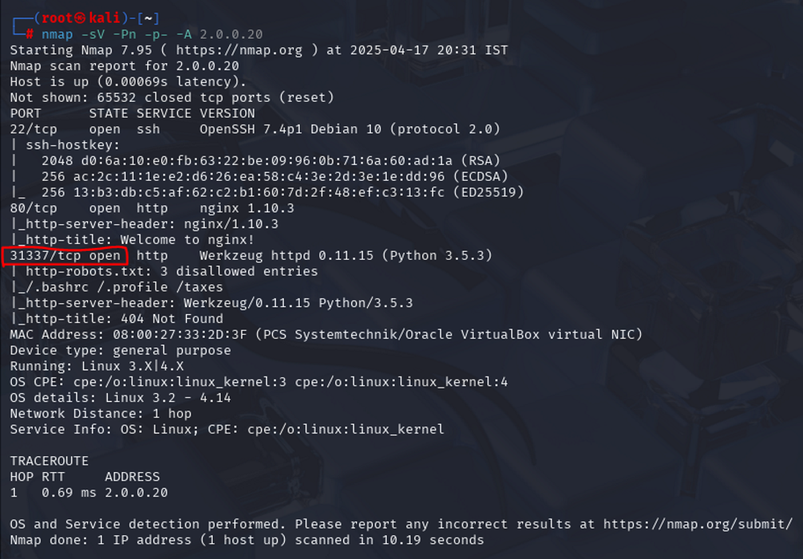

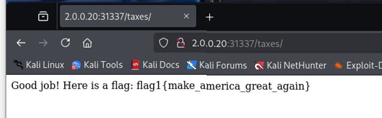
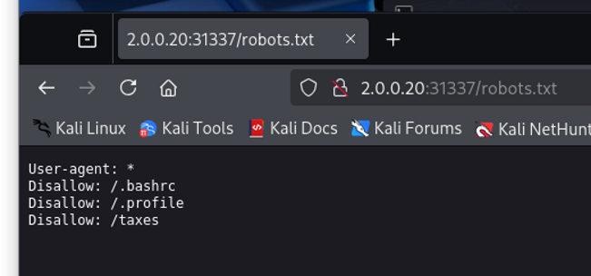
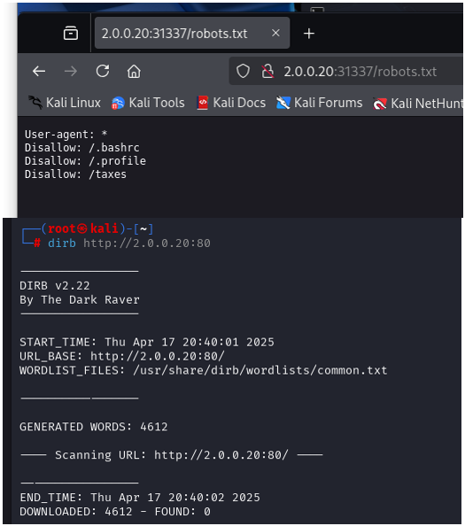
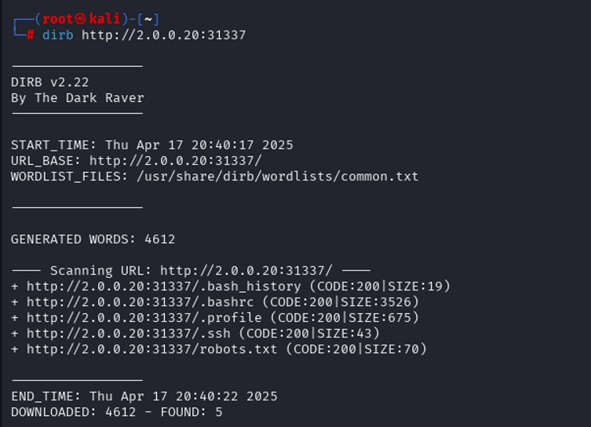

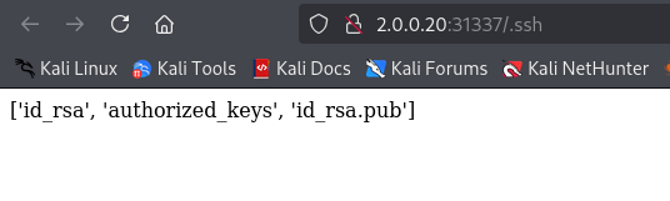
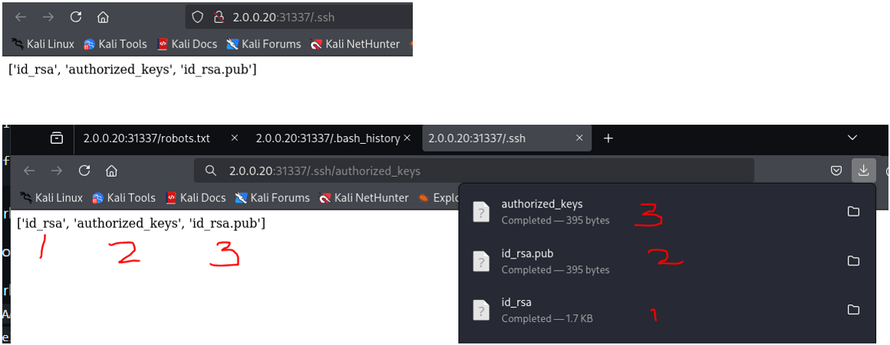

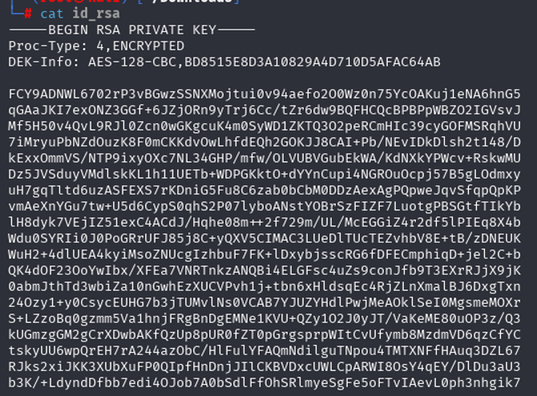

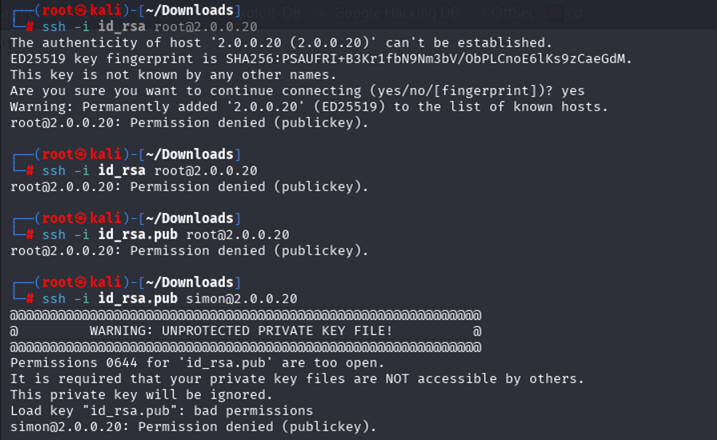
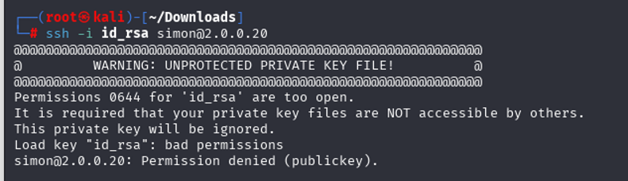

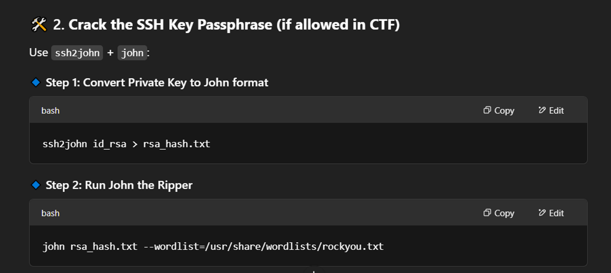
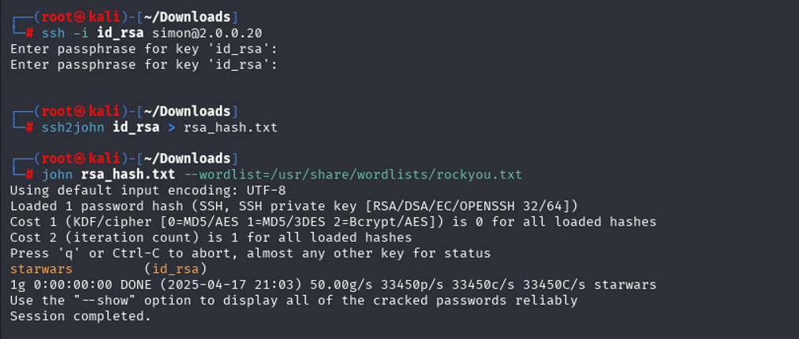
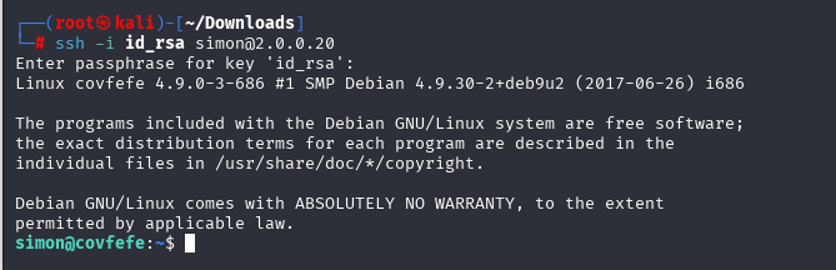
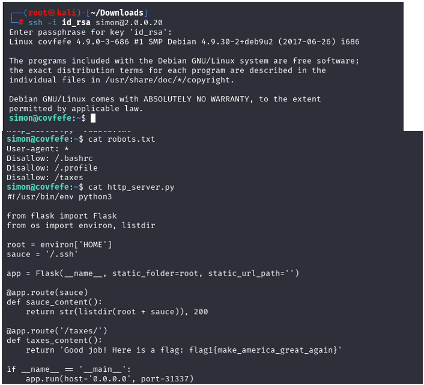
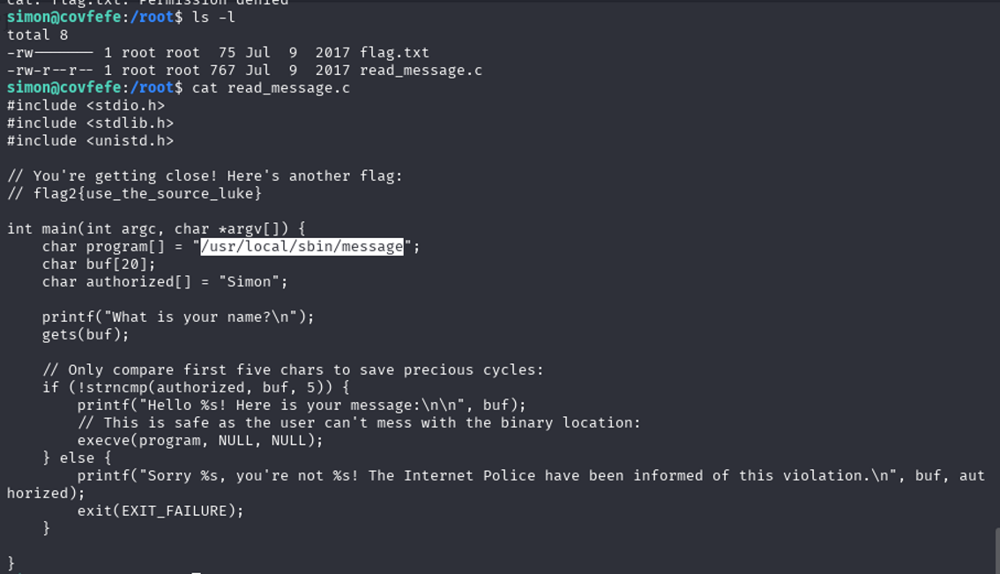

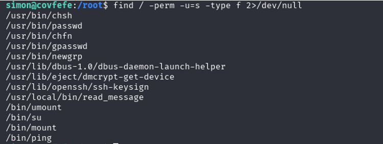