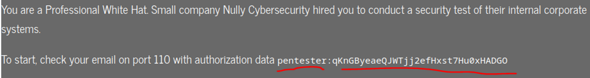
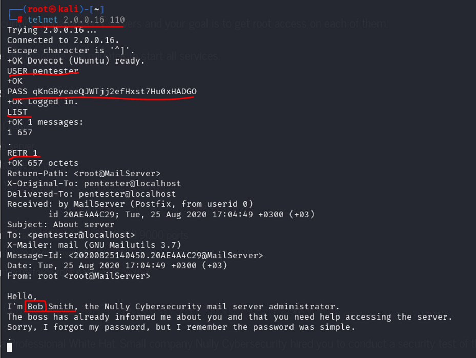
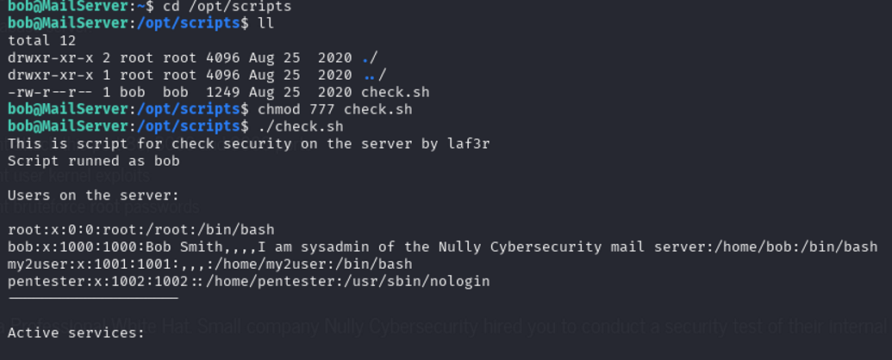
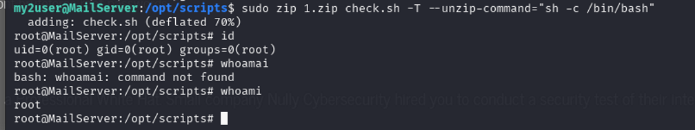
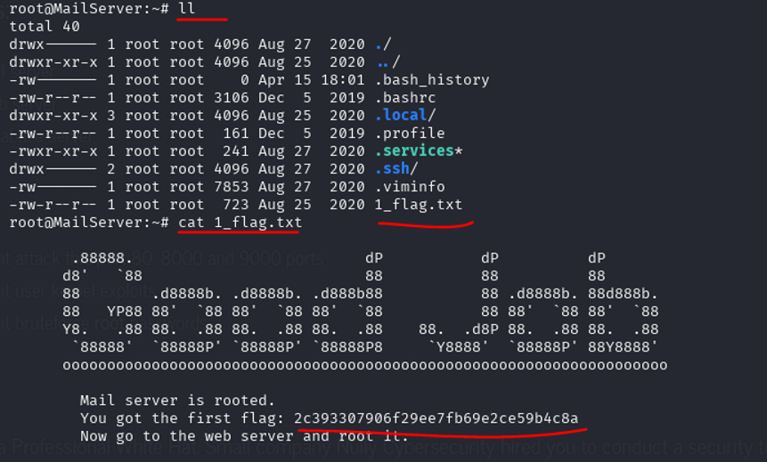
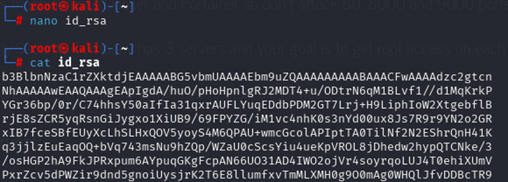

# Double Pivot Attack
-------------
Machine name : Null Cybersecurity 
We have 3 servers to explore till root
- Description of the machine
  
- Basic Netdiscover or arpscan can work to get the ip address of the machine

- NMAP results are as follows

NMAP results are as follows
```bash
#nmap -sV -Pn -p- -A 2.0.0.16
Starting Nmap 7.94SVN ( https://nmap.org ) at 2025-04-15 20:03 IST
Nmap scan report for 2.0.0.16
Host is up (0.00049s latency).
Not shown: 65530 closed tcp ports (reset)
PORT     STATE SERVICE     VERSION
80/tcp   open  http        Apache httpd 2.4.29 ((Ubuntu))
|_http-title: Welcome to the Nully Cybersecurity CTF
|_http-server-header: Apache/2.4.29 (Ubuntu)
110/tcp  open  pop3        Dovecot pop3d
|_pop3-capabilities: UIDL SASL(PLAIN LOGIN) USER CAPA AUTH-RESP-CODE PIPELINING RESP-CODES TOP
2222/tcp open  ssh         OpenSSH 8.2p1 Ubuntu 4 (Ubuntu Linux; protocol 2.0)
| ssh-hostkey: 
|   3072 8d:c1:b0:f5:0a:3d:1c:32:80:91:14:c5:3b:04:e1:3e (RSA)
|   256 cb:22:f4:e3:e1:f1:61:68:58:91:9a:96:19:35:2c:ff (ECDSA)
|_  256 a5:e3:48:57:49:55:85:f9:8c:9a:c1:8c:a6:49:f5:2d (ED25519)
8000/tcp open  nagios-nsca Nagios NSCA
|_http-title: Site doesn't have a title (text/plain; charset=utf-8).
9000/tcp open  cslistener?
| fingerprint-strings: 
|   GenericLines: 
|     HTTP/1.1 400 Bad Request
|     Content-Type: text/plain; charset=utf-8
|     Connection: close
|     Request
|   GetRequest, HTTPOptions: 
|     HTTP/1.0 200 OK
|     Accept-Ranges: bytes
|     Cache-Control: max-age=31536000
|     Content-Length: 23203
|     Content-Type: text/html; charset=utf-8
|     Last-Modified: Wed, 22 Jul 2020 22:47:36 GMT
|     X-Content-Type-Options: nosniff
|     X-Xss-Protection: 1; mode=block
|     Date: Tue, 15 Apr 2025 14:33:45 GMT
|     <!DOCTYPE html
|     ><html lang="en" ng-app="portainer">
|     <head>
|     <meta charset="utf-8" />
|     <title>Portainer</title>
|     <meta name="description" content="" />
|     <meta name="author" content="Portainer.io" />
|     <!-- HTML5 shim, for IE6-8 support of HTML5 elements -->
|     <!--[if lt IE 9]>
|     <script src="//html5shim.googlecode.com/svn/trunk/html5.js"></script>
|     <![endif]-->
|     <!-- Fav and touch icons -->
|     <link rel="apple-touch-icon" sizes="180x180" href="dc4d092847be46242d8c013d1bc7c494.png" />
|_    <link rel="icon" type="Doublepivotimages/image/png" sizes="32x32" href="5ba13dcb526292ae707310a54e103cd1.png"
1 service unrecognized despite returning data. If you know the service/version, please submit the following fingerprint at https://nmap.org/cgi-bin/submit.cgi?new-service :
SF-Port9000-TCP:V=7.94SVN%I=7%D=4/15%Time=67FE6E4A%P=x86_64-pc-linux-gnu%r
SF:(GenericLines,67,"HTTP/1\.1\x20400\x20Bad\x20Request\r\nContent-Type:\x
SF:20text/plain;\x20charset=utf-8\r\nConnection:\x20close\r\n\r\n400\x20Ba
SF:d\x20Request")%r(GetRequest,5BC1,"HTTP/1\.0\x20200\x20OK\r\nAccept-Rang
SF:es:\x20bytes\r\nCache-Control:\x20max-age=31536000\r\nContent-Length:\x
SF:2023203\r\nContent-Type:\x20text/html;\x20charset=utf-8\r\nLast-Modifie
SF:d:\x20Wed,\x2022\x20Jul\x202020\x2022:47:36\x20GMT\r\nX-Content-Type-Op
SF:tions:\x20nosniff\r\nX-Xss-Protection:\x201;\x20mode=block\r\nDate:\x20
SF:Tue,\x2015\x20Apr\x202025\x2014:33:45\x20GMT\r\n\r\n<!DOCTYPE\x20html\n
SF:><html\x20lang=\"en\"\x20ng-app=\"portainer\">\n\x20\x20<head>\n\x20\x2
SF:0\x20\x20<meta\x20charset=\"utf-8\"\x20/>\n\x20\x20\x20\x20<title>Porta
SF:iner</title>\n\x20\x20\x20\x20<meta\x20name=\"description\"\x20content=
SF:\"\"\x20/>\n\x20\x20\x20\x20<meta\x20name=\"author\"\x20content=\"Porta
SF:iner\.io\"\x20/>\n\n\x20\x20\x20\x20<!--\x20HTML5\x20shim,\x20for\x20IE
SF:6-8\x20support\x20of\x20HTML5\x20elements\x20-->\n\x20\x20\x20\x20<!--\
SF:[if\x20lt\x20IE\x209\]>\n\x20\x20\x20\x20\x20\x20<script\x20src=\"//htm
SF:l5shim\.googlecode\.com/svn/trunk/html5\.js\"></script>\n\x20\x20\x20\x
SF:20<!\[endif\]-->\n\n\x20\x20\x20\x20<!--\x20Fav\x20and\x20touch\x20icon
SF:s\x20-->\n\x20\x20\x20\x20<link\x20rel=\"apple-touch-icon\"\x20sizes=\"
SF:180x180\"\x20href=\"dc4d092847be46242d8c013d1bc7c494\.png\"\x20/>\n\x20
SF:\x20\x20\x20<link\x20rel=\"icon\"\x20type=\"Doublepivotimages/image/png\"\x20sizes=\"32x3
SF:2\"\x20href=\"5ba13dcb526292ae707310a54e103cd1\.png\"")%r(HTTPOptions,3
SF:406,"HTTP/1\.0\x20200\x20OK\r\nAccept-Ranges:\x20bytes\r\nCache-Control
SF::\x20max-age=31536000\r\nContent-Length:\x2023203\r\nContent-Type:\x20t
SF:ext/html;\x20charset=utf-8\r\nLast-Modified:\x20Wed,\x2022\x20Jul\x2020
SF:20\x2022:47:36\x20GMT\r\nX-Content-Type-Options:\x20nosniff\r\nX-Xss-Pr
SF:otection:\x201;\x20mode=block\r\nDate:\x20Tue,\x2015\x20Apr\x202025\x20
SF:14:33:45\x20GMT\r\n\r\n<!DOCTYPE\x20html\n><html\x20lang=\"en\"\x20ng-a
SF:pp=\"portainer\">\n\x20\x20<head>\n\x20\x20\x20\x20<meta\x20charset=\"u
SF:tf-8\"\x20/>\n\x20\x20\x20\x20<title>Portainer</title>\n\x20\x20\x20\x2
SF:0<meta\x20name=\"description\"\x20content=\"\"\x20/>\n\x20\x20\x20\x20<
SF:meta\x20name=\"author\"\x20content=\"Portainer\.io\"\x20/>\n\n\x20\x20\
SF:x20\x20<!--\x20HTML5\x20shim,\x20for\x20IE6-8\x20support\x20of\x20HTML5
SF:\x20elements\x20-->\n\x20\x20\x20\x20<!--\[if\x20lt\x20IE\x209\]>\n\x20
SF:\x20\x20\x20\x20\x20<script\x20src=\"//html5shim\.googlecode\.com/svn/t
SF:runk/html5\.js\"></script>\n\x20\x20\x20\x20<!\[endif\]-->\n\n\x20\x20\
SF:x20\x20<!--\x20Fav\x20and\x20touch\x20icons\x20-->\n\x20\x20\x20\x20<li
SF:nk\x20rel=\"apple-touch-icon\"\x20sizes=\"180x180\"\x20href=\"dc4d09284
SF:7be46242d8c013d1bc7c494\.png\"\x20/>\n\x20\x20\x20\x20<link\x20rel=\"ic
SF:on\"\x20type=\"Doublepivotimages/image/png\"\x20sizes=\"32x32\"\x20href=\"5ba13dcb526292a
SF:e707310a54e103cd1\.png\"");
MAC Address: 08:00:27:1E:8D:7C (Oracle VirtualBox virtual NIC)
Device type: general purpose
Running: Linux 4.X|5.X
OS CPE: cpe:/o:linux:linux_kernel:4 cpe:/o:linux:linux_kernel:5
OS details: Linux 4.15 - 5.8
Network Distance: 1 hop
Service Info: OS: Linux; CPE: cpe:/o:linux:linux_kernel
 
TRACEROUTE
HOP RTT     ADDRESS
1   0.49 ms 2.0.0.16
 
OS and Service detection performed. Please report any incorrect results at https://nmap.org/submit/ .
Nmap done: 1 IP address (1 host up) scanned in 91.30 seconds
```
- After analyzing the Nmap results we found that there is port 80 is available  it in URL

- We can found 1 user login credentials 

-  Lets try TELNET  with port 110 . Note:- they have mentioned above  strictly not to use 80,8000,9000
-  Port 110
Username : pentester
 Password: qKnGByeaeQJWTjj2efHxst7Hu0xHADGO
- After login with credentials lets try to list the messages in this server and we have found one. Lets retrieve the mail with RETR 1 command. After retrieving and reading the mail we it is stating that there is a user called bob and his password is easy to guess.

- So let us use create one more wordlist extracting bob,bobby words from the /wordlist.txt as below
- Use Hydra with new word list will take 5 –10 min of time to brake the password.

- Login with the user name and password with the credential to port 2222

- Lets try to go horizontal escalation

- Found that there is bash file called  check.sh in /opt/scripts. From the script we can observe ther is another user called "my2user" so lets Try to execute check.sh file with my2user with small modification in it I.e., add "/bin/bash" in the seconded line of  bash code.


- After executing the check.sh with my2user we became my2user now

- Now try to find the files that are having permission to root/super user with the help of find tool

- After executing the privilege escalation with zip from gtfobins results are as follows

- Or we can user the below single line of command as well.

- Now go to root folder as the and ther you can find the flag with 1_flag.txt

---------------------------------------------------
# SECOND SERVER
-  Now from the my2user we need to do routing and pivoting. After becoming the root user to mail server now try to make a tunnel between mailserver to the localmachine (kali) using ssh-keygen login, we need to create  public key and private keys to login the mailserver from anywhere inside the network.

- We will get the id_rsa and id_rsa.pub  files after executing ssh-keygen. 
  
- Now copy the public key to id_rsa.pub file  and past it inside the ~./ssh/authorized_keys.  
  
- Same way copy the id_rsa content of the file which is private key for login.
  
-  Create a file id_rsa in you kali using nano and past the private key inside it and save it and make it executable 
  
- Now try login with  2.0.0.16 which is outside of the docker who is having access to docker network to kali as follows
  
- Through this we have entered into the docker network inside kali. Now fetch for docker network if ifconfig results are as follows

-  To get the other services on the docker try netdiscover. Try it by installing it as follows
  
- From the try netdiscover with the range option specifying the subnet of 16 and  result we observed that there are few more services like Database server and webserver other than mail server so total of 3.
   1.172.17.0.4 - mail server
   2.172.17.0.3 - webserver
   3.172.17.0.5 - database server


- Now with the same ssh-key I.e., id_rsa try login to the 172.17.0.3 with port 80.  and bind 9000 with local port forwarding to the ssh. Note:- that kali port is 9000 not 8000
  
- After creating the successful local port forwarding to out kali try below cmd and webpage access for with the dirbuster results
  
-  With directory brutforcing attack on the ip we found there is a ping folder as below
  
- We can try our  command injection from here  after the ping .php make one ? And write the command for execution
  
- Meanwhile install netcat for out horizontal excalation

- We are still under mail server only. Now try copying nc to the home folder
  
- Enable python server specifying the port number
  
-  Execute the netcat command and make  the server to listening mode. Meanwhile open the same port number open in kali browser. Through this we entered into the shell  and there we can find the 2 files
  
-  In the file command user 1001/1000, Finds files owned by user with UID (User ID) 1001 or 1000
```bash
How Linux UIDs Work
UID 0 = root (superuser)
UID 1-999 = System users (services, daemons)
UID 1000+ = Regular users (typically starts at 1000)
For user 1001 as oliver have secret file
```
- For user 1001 as oliver have secret file
  
-  For user 1000 python3 is available
  
- Cat that secret file. Try login with username  oliver  and password secret key
  
  
-  After the login trying to  horizontal privilege attract with another user oscar using python command here as follows after login inito oscar fo to the home folder and go to oscar folder ther you can see the my_password file consists oscar user password 
  
- Login with ssh username oscar and password from my_password file
  
- After becoming oscar user go to folder scripts  and there you can find  current-date file
  
-  Try to execute the file if not make it to executable and execute the file with strings command
  
- After that  try to create a path  and then export it to the 
    Note:- 
           1.PATH is a system environment variable that stores a list of directories where the system looks for executable programs/commands.
           2.The system will now look in /home/oscar before other directories when searching for executables.
           3.Temporary: Only lasts for the current session.
- Now create a file called date in /bin/bash and then make it executable. Now try to execute the current-date file in scripts folder. We have received root here and try to open the root files check the flag
  
  
  ------------------
  # Third - Database root access

   1.  After login into the webserver as root. Try to connect the database server 172.17.0.5 with ftp since it is opened 
   
   2.  After searching the folder  we can able to find the .backup.zip and file.txt 
get the files from database server to webserver using get command
   
   3.  Install netcat in webserver as well

   4.  While trying to unzip the backup file it asking for the password so lets try to  transfer the file to kali linux and use zip2john command there.
   5. First enable port 8888 listening on our kali and then file name
   6. Then transfer the file from webserver to the kali linux ip
   Note: Connection closes after 3 seconds of inactivity (-w 3)
   This is kali terminal

-    This is webserver terminal


   7.  With the help of john  tool make a hash file for the backup.zip to hash.txt
   8. Then decrypt the file hash.tct with jonn here comes the password to open the zip file. After unzipping backup.zip file we observed a cards.txt file created. After opening it found the user credentials which is user for database server
   9. Try to login with the donald credentials and now we are moving toward horizontal escalation.
   10. This time we are using linpease  download it from git and make a executable  and run the exploit interestingly found the files with interesting permissions


  11. Found Unknown SUID binary of screen-4.5.0

  12. We are going to user the exploit script  as above for entering into root shell
link for the script  :- https://www.exploit-db.com/raw/41154


  13. Run the exploit and from exploit db and got the vertical privilege access now go to the root folder and search for the flag

 
