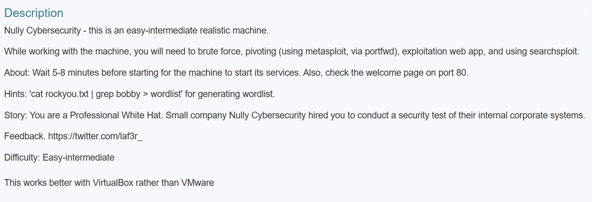
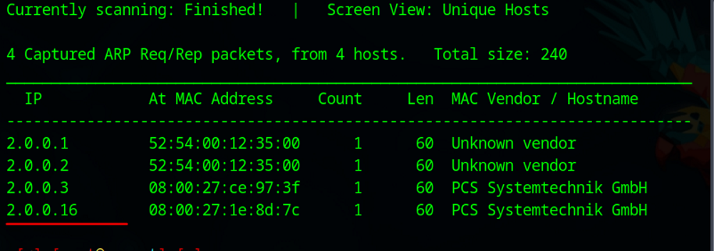
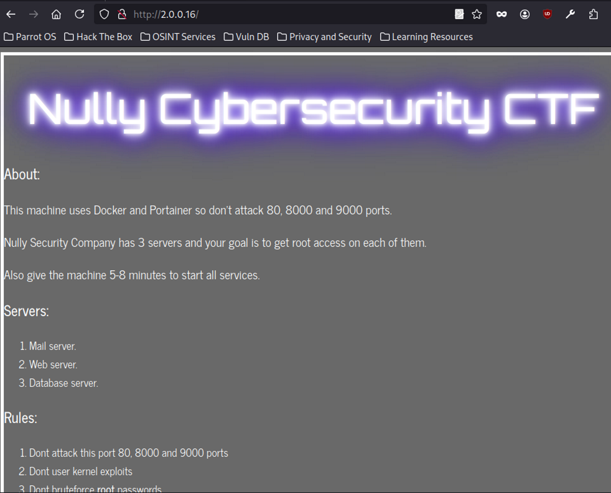

# Double Pivot Attack
## Machine name : Null Cybersecurity 
We have 3 servers to explore till root
1. Description of the machine

Basic Netdiscover or arpsacn can work to get the ip address of the machine

2. NMAP results are as follows
```bash   
 #nmap -sV -Pn -p- -A 2.0.0.16
 Starting Nmap 7.94SVN ( https://nmap.org ) at 2025-04-15 20:03 IST
 Nmap scan report for 2.0.0.16
 Host is up (0.00049s latency).
 Not shown: 65530 closed tcp ports (reset)
 PORT     STATE SERVICE     VERSION
 80/tcp   open  http        Apache httpd 2.4.29 ((Ubuntu))
 |_http-title: Welcome to the Nully Cybersecurity CTF
 |_http-server-header: Apache/2.4.29 (Ubuntu)
 110/tcp  open  pop3        Dovecot pop3d
 |_pop3-capabilities: UIDL SASL(PLAIN LOGIN) USER CAPA AUTH-RESP-CODE PIPELINING RESP-CODES TOP
 2222/tcp open  ssh         OpenSSH 8.2p1 Ubuntu 4 (Ubuntu Linux; protocol 2.0)
 | ssh-hostkey: 
 |   3072 8d:c1:b0:f5:0a:3d:1c:32:80:91:14:c5:3b:04:e1:3e (RSA)
 |   256 cb:22:f4:e3:e1:f1:61:68:58:91:9a:96:19:35:2c:ff (ECDSA)
 |_  256 a5:e3:48:57:49:55:85:f9:8c:9a:c1:8c:a6:49:f5:2d (ED25519)
 8000/tcp open  nagios-nsca Nagios NSCA
 |_http-title: Site doesn't have a title (text/plain; charset=utf-8).
 9000/tcp open  cslistener?
 | fingerprint-strings: 
 |   GenericLines: 
 |     HTTP/1.1 400 Bad Request
 |     Content-Type: text/plain; charset=utf-8
 |     Connection: close
 |     Request
 |   GetRequest, HTTPOptions: 
 |     HTTP/1.0 200 OK
 |     Accept-Ranges: bytes
 |     Cache-Control: max-age=31536000
 |     Content-Length: 23203
 |     Content-Type: text/html; charset=utf-8
 |     Last-Modified: Wed, 22 Jul 2020 22:47:36 GMT
 |     X-Content-Type-Options: nosniff
 |     X-Xss-Protection: 1; mode=block
 |     Date: Tue, 15 Apr 2025 14:33:45 GMT
 |     <!DOCTYPE html
 |     ><html lang="en" ng-app="portainer">
 |     <head>
 |     <meta charset="utf-8" />
 |     <title>Portainer</title>
 |     <meta name="description" content="" />
 |     <meta name="author" content="Portainer.io" />
 |     <!-- HTML5 shim, for IE6-8 support of HTML5 elements -->
 |     <!--[if lt IE 9]>
 |     <script src="//html5shim.googlecode.com/svn/trunk/html5.js"></script>
 |     <![endif]-->
 |     <!-- Fav and touch icons -->
 |     <link rel="apple-touch-icon" sizes="180x180" href="dc4d092847be46242d8c013d1bc7c494.png" />
 |_    <link rel="icon" type="image/png" sizes="32x32" href="5ba13dcb526292ae707310a54e103cd1.png"
 1 service unrecognized despite returning data. If you know the service/version, please submit the following fingerprint at https://nmap.org/cgi-bin/submit.cgi?new-service :
 SF-Port9000-TCP:V=7.94SVN%I=7%D=4/15%Time=67FE6E4A%P=x86_64-pc-linux-gnu%r
 SF:(GenericLines,67,"HTTP/1\.1\x20400\x20Bad\x20Request\r\nContent-Type:\x
 SF:20text/plain;\x20charset=utf-8\r\nConnection:\x20close\r\n\r\n400\x20Ba
 SF:d\x20Request")%r(GetRequest,5BC1,"HTTP/1\.0\x20200\x20OK\r\nAccept-Rang
 SF:es:\x20bytes\r\nCache-Control:\x20max-age=31536000\r\nContent-Length:\x
 SF:2023203\r\nContent-Type:\x20text/html;\x20charset=utf-8\r\nLast-Modifie
 SF:d:\x20Wed,\x2022\x20Jul\x202020\x2022:47:36\x20GMT\r\nX-Content-Type-Op
 SF:tions:\x20nosniff\r\nX-Xss-Protection:\x201;\x20mode=block\r\nDate:\x20
 SF:Tue,\x2015\x20Apr\x202025\x2014:33:45\x20GMT\r\n\r\n<!DOCTYPE\x20html\n
 SF:><html\x20lang=\"en\"\x20ng-app=\"portainer\">\n\x20\x20<head>\n\x20\x2
 SF:0\x20\x20<meta\x20charset=\"utf-8\"\x20/>\n\x20\x20\x20\x20<title>Porta
 SF:iner</title>\n\x20\x20\x20\x20<meta\x20name=\"description\"\x20content=
 SF:\"\"\x20/>\n\x20\x20\x20\x20<meta\x20name=\"author\"\x20content=\"Porta
 SF:iner\.io\"\x20/>\n\n\x20\x20\x20\x20<!--\x20HTML5\x20shim,\x20for\x20IE
 SF:6-8\x20support\x20of\x20HTML5\x20elements\x20-->\n\x20\x20\x20\x20<!--\
 SF:[if\x20lt\x20IE\x209\]>\n\x20\x20\x20\x20\x20\x20<script\x20src=\"//htm
 SF:l5shim\.googlecode\.com/svn/trunk/html5\.js\"></script>\n\x20\x20\x20\x
 SF:20<!\[endif\]-->\n\n\x20\x20\x20\x20<!--\x20Fav\x20and\x20touch\x20icon
 SF:s\x20-->\n\x20\x20\x20\x20<link\x20rel=\"apple-touch-icon\"\x20sizes=\"
 SF:180x180\"\x20href=\"dc4d092847be46242d8c013d1bc7c494\.png\"\x20/>\n\x20
 SF:\x20\x20\x20<link\x20rel=\"icon\"\x20type=\"image/png\"\x20sizes=\"32x3
 SF:2\"\x20href=\"5ba13dcb526292ae707310a54e103cd1\.png\"")%r(HTTPOptions,3
 SF:406,"HTTP/1\.0\x20200\x20OK\r\nAccept-Ranges:\x20bytes\r\nCache-Control
 SF::\x20max-age=31536000\r\nContent-Length:\x2023203\r\nContent-Type:\x20t
 SF:ext/html;\x20charset=utf-8\r\nLast-Modified:\x20Wed,\x2022\x20Jul\x2020
 SF:20\x2022:47:36\x20GMT\r\nX-Content-Type-Options:\x20nosniff\r\nX-Xss-Pr
 SF:otection:\x201;\x20mode=block\r\nDate:\x20Tue,\x2015\x20Apr\x202025\x20
 SF:14:33:45\x20GMT\r\n\r\n<!DOCTYPE\x20html\n><html\x20lang=\"en\"\x20ng-a
 SF:pp=\"portainer\">\n\x20\x20<head>\n\x20\x20\x20\x20<meta\x20charset=\"u
 SF:tf-8\"\x20/>\n\x20\x20\x20\x20<title>Portainer</title>\n\x20\x20\x20\x2
 SF:0<meta\x20name=\"description\"\x20content=\"\"\x20/>\n\x20\x20\x20\x20<
 SF:meta\x20name=\"author\"\x20content=\"Portainer\.io\"\x20/>\n\n\x20\x20\
 SF:x20\x20<!--\x20HTML5\x20shim,\x20for\x20IE6-8\x20support\x20of\x20HTML5
 SF:\x20elements\x20-->\n\x20\x20\x20\x20<!--\[if\x20lt\x20IE\x209\]>\n\x20
 SF:\x20\x20\x20\x20\x20<script\x20src=\"//html5shim\.googlecode\.com/svn/t
 SF:runk/html5\.js\"></script>\n\x20\x20\x20\x20<!\[endif\]-->\n\n\x20\x20\
 SF:x20\x20<!--\x20Fav\x20and\x20touch\x20icons\x20-->\n\x20\x20\x20\x20<li
 SF:nk\x20rel=\"apple-touch-icon\"\x20sizes=\"180x180\"\x20href=\"dc4d09284
 SF:7be46242d8c013d1bc7c494\.png\"\x20/>\n\x20\x20\x20\x20<link\x20rel=\"ic
 SF:on\"\x20type=\"image/png\"\x20sizes=\"32x32\"\x20href=\"5ba13dcb526292a
 SF:e707310a54e103cd1\.png\"");
 MAC Address: 08:00:27:1E:8D:7C (Oracle VirtualBox virtual NIC)
 Device type: general purpose
 Running: Linux 4.X|5.X
 OS CPE: cpe:/o:linux:linux_kernel:4 cpe:/o:linux:linux_kernel:5
 OS details: Linux 4.15 - 5.8
 Network Distance: 1 hop
 Service Info: OS: Linux; CPE: cpe:/o:linux:linux_kernel
  
 TRACEROUTE
 HOP RTT     ADDRESS
 1   0.49 ms 2.0.0.16
  
 OS and Service detection performed. Please report any incorrect results at https://nmap.org/submit/ .
 Nmap done: 1 IP address (1 host up) scanned in 91.30 seconds
```
3. After analyzing the Nmap results we found that there is port 80 is available  it in URL

4.  We can found 1 user login credentials 
 
5.  Lets try TELNET  with port 110 . Note:- they have mentioned above  strictly not to use 80,8000,9000
   Port 110
   Username : pentester
    Password: qKnGByeaeQJWTjj2efHxst7Hu0xHADGO
6. After login with credentials lets try to list the messages in this server and we have found one. Lets retrieve the mail with RETR 1 command. After retrieving and reading the mail we it is stating that there is a user called bob and his password is easy to guess.
   After login with credentials lets try to list the messages in this server and we have found one. Lets retrieve the mail with RETR 1 command. After retrieving and reading the mail we it is stating that there is a user called bob and his password is easy to guess.
   
 