# Sprint 1
-------------
1. There are multiple users in this machine

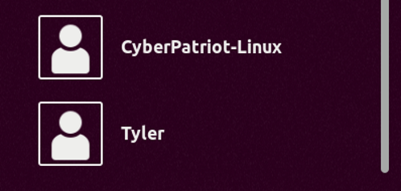
2. Now trying user Derek  with Username - Derek Password - Derek001
3. After logged in checking version observed that the os is Ubuntu 18.04.5  LTS
   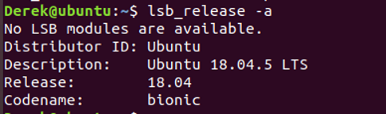
    4. Method 1:
I transferred my kali exploit file through scp command  in victim machine and runed exploit it given me the access
 and observed multiple exploit scripts are able to perform and can able to access the root privilege 
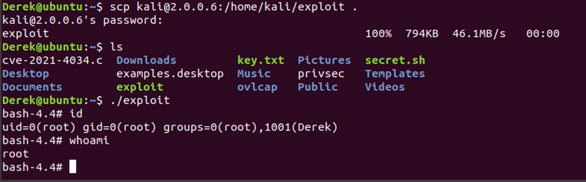
Method 2:Using Find method
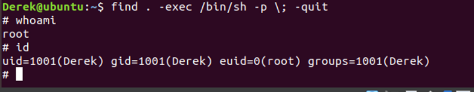
Another user 
Username : Axel
 password: Axel003
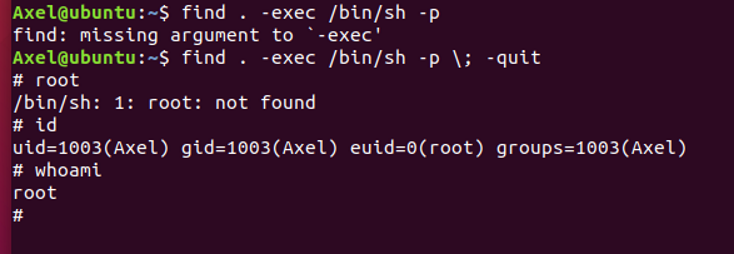
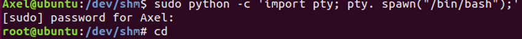
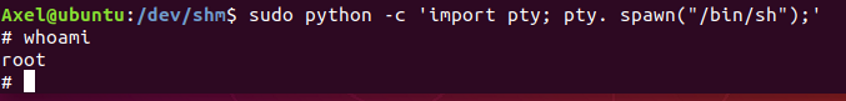

Another user 
Username : Chrono
 password: Chrono004

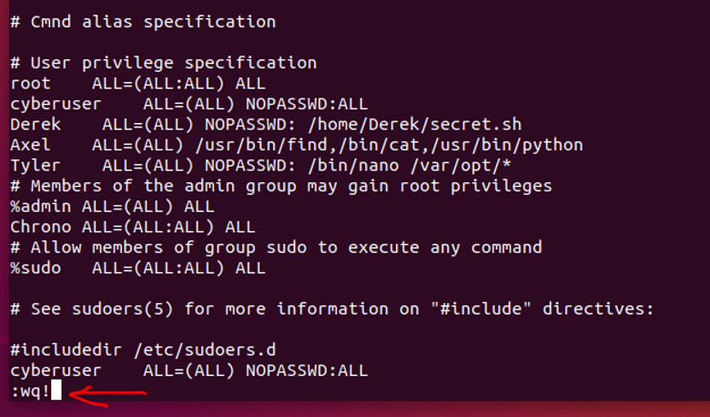
To exit press esc button then type :wq! And enter. Type sudo su enter

Another user 
Username : Tyler
 password: Tyler002

Using nano and sudo 
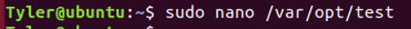
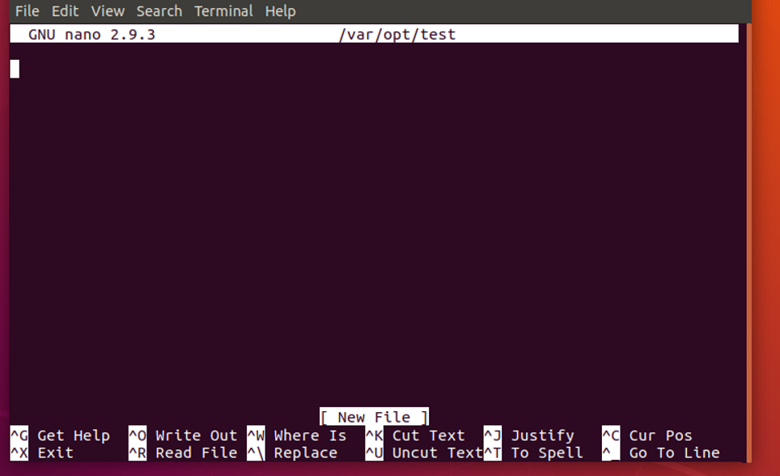
Here press control R

Press control X
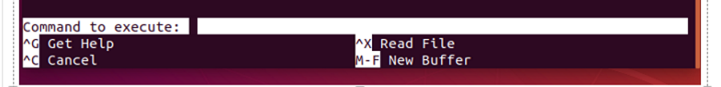
At the execute  type : reset; sh 1 >&0 2>&0 press enter

To get # in the command line. Now type root@ubuntu:~#

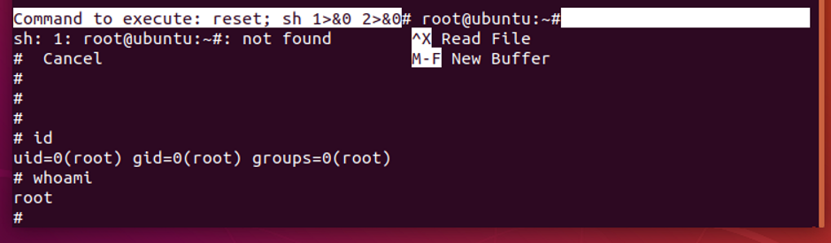
Another user 
Username : Cassidy
 password: Cassidy005

1. Making changes in cleanup.py file we can get root access as follows
2. Edit the cleanup.py file as follows and run /tmp/rootbash -p
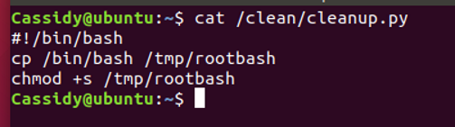
Another method
3. Find SUID files enter into previous privilage with cmd: /bin/bash -p 

Then create a file called test
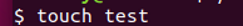
Using that command  and find try to get root access as below
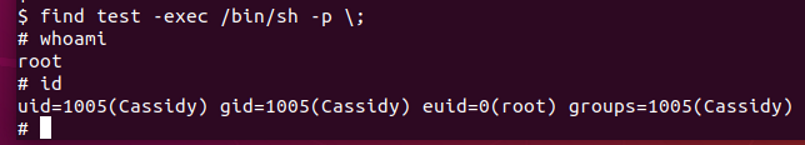