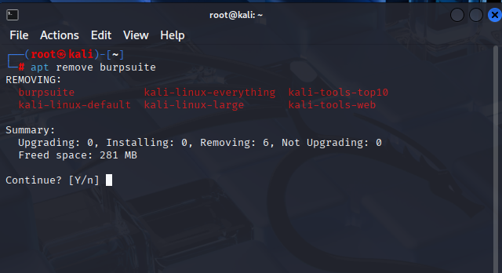
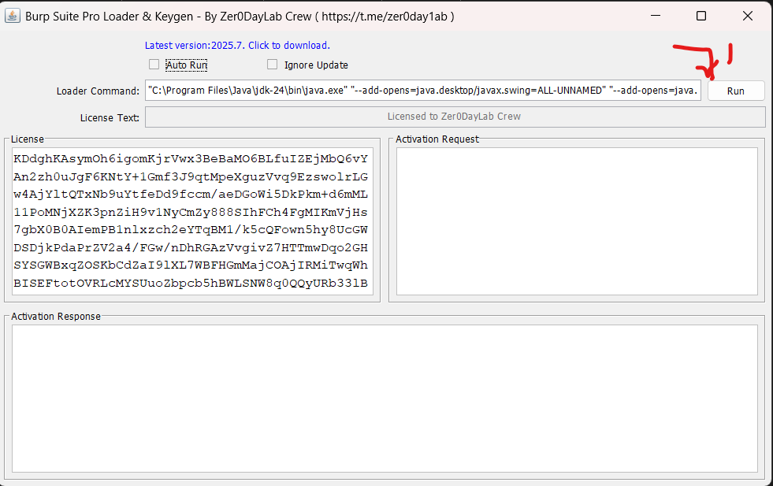
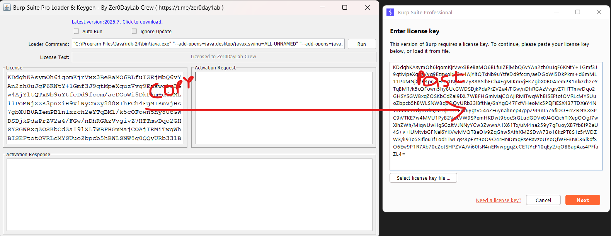
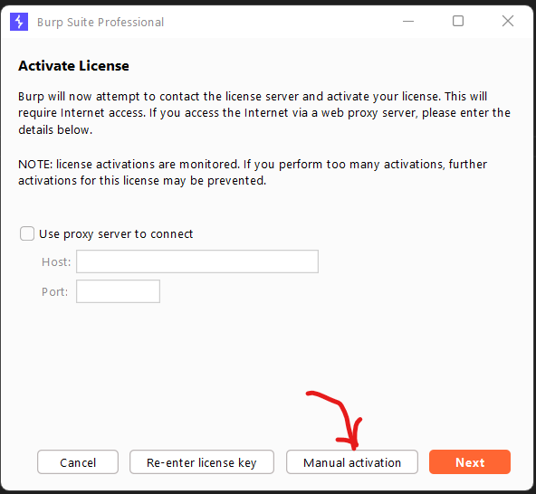
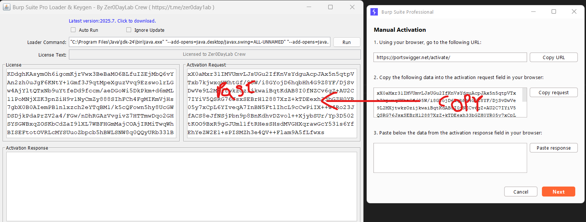
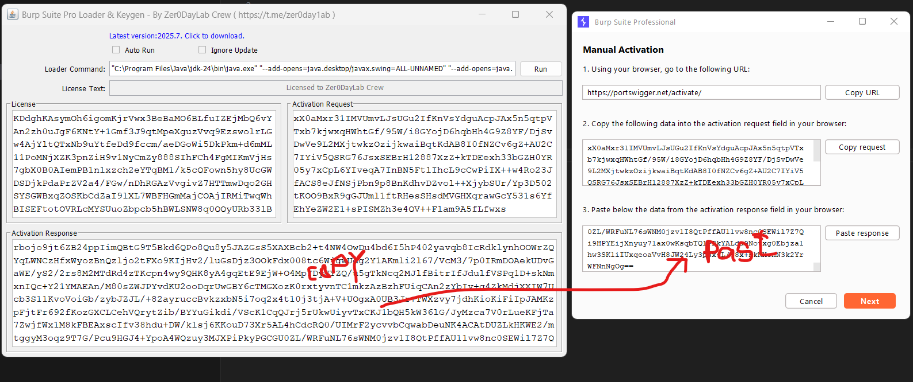
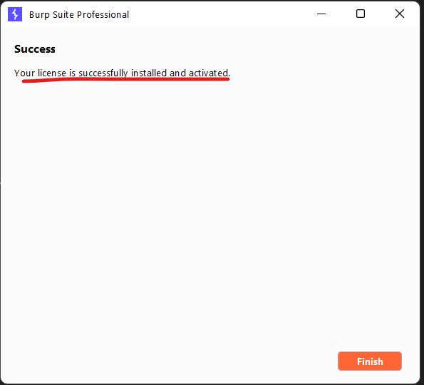
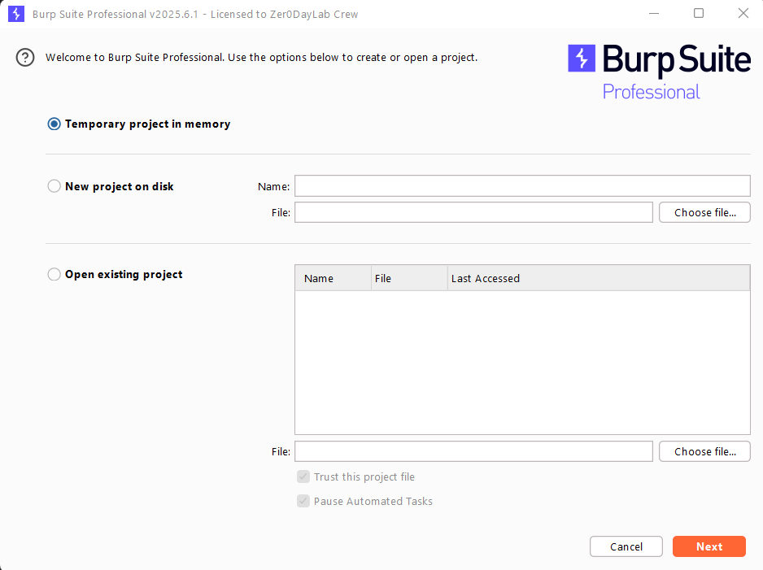
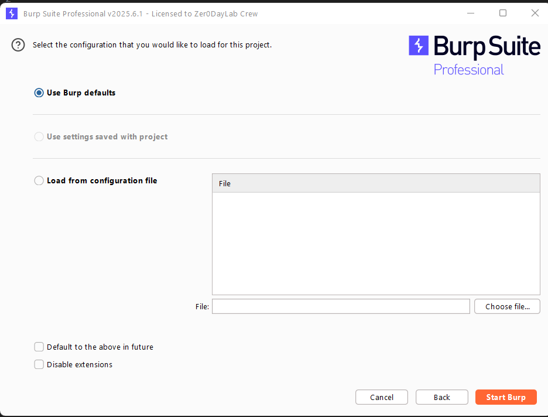

# Burpsuite pro instilation in Linux( Kali Linux and Parrot OS)
------------------------------------------------
Note First uninstall the old version of Burp Suite community edition if you have any.
```bash
sudo apt remove burpsuite
```

## Steps to Install Burp Suite Pro on Linux
1. Download Burp suite pro from link  - [Burp Suite pro 2025.6](https://mtp0-my.sharepoint.com/:u:/g/personal/vamsidhar_mtp0_onmicrosoft_com/EYNPAM7RNhJKttBZMUWh3_4ByqDE2P0P_F_o0-gtvF--ZQ?e=2r1X8A)
2. Extract the zip file and find the java jdk or you can doanloade from official website by clicking the link [java 24](https://jdk.java.net/24/)
3. First install the java24 and set the evironment variable.
   - Open a terminal and run the following commands:
     ```bash
     sudo apt update
     sudo mkdir -p /usr/lib/jvm
     cd Downloads 
     sudo tar -xzf openjdk-24.0.2_linux-x64_bin.tar.gz -C /usr/lib/jvm
     sudo update-alternatives --install /usr/bin/java java /usr/lib/jvm/jdk-24.0.2/bin/java 1
     sudo update-alternatives --install /usr/bin/javac javac /usr/lib/jvm/jdk-24.0.2/bin/javac 1
     sudo update-alternatives --config java  # Select JDK 24
     java -version
     ```
Note: Environment variables setup

```bash
    sudo nano /etc/environment.d/java24.conf
```
  - add the following lines:
```bash
    JAVA_HOME="/usr/lib/jvm/jdk-24.0.2"
    PATH="$PATH:$JAVA_HOME/bin"
```
  - Save and exit the file.
```bash
  source /etc/environment.d/java24.conf
```
  - Verify the installation:
```bash
echo $JAVA_HOME    # Should show `/usr/lib/jvm/jdk-24.0.2`
java -version      # Should show Java 24
```
- open the downloaded Burp Suite Pro directory
```bash
   unzip BurpSuitePro-2025.6.zip
   cd BurpSuitePro-2025.6
   java -jar burploader.jar
```
1. open the burploader.jar file
     ```bash
   java -jar burploader.jar
    ```


1. click Next
2. click on Manual Activation


1. copy the activation response  code and past in activation response code box
2. 
3. click on Next and then Finish. You can see the Burp Suite Pro is installed successfully.





-----------------------------------------------------------------
## Additional Notes
- Installing the ca certification as [Firefox CA setup](https://portswigger.net/burp/documentation/desktop/external-browser-config/certificate/ca-cert-firefox)