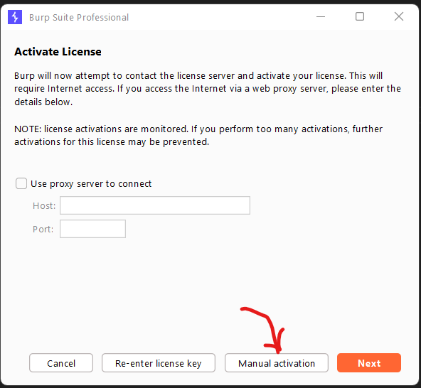
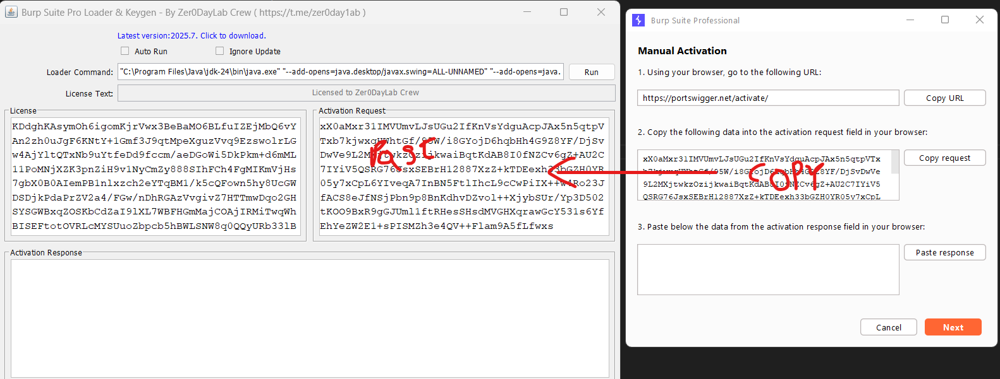

# Burpsuite Pro instlation on Windows
------------------------------------------------
1. Download Burp suite pro from link  - [Burp Suite pro 2025.6](https://mtp0-my.sharepoint.com/:u:/g/personal/vamsidhar_mtp0_onmicrosoft_com/EYNPAM7RNhJKttBZMUWh3_4ByqDE2P0P_F_o0-gtvF--ZQ?e=2r1X8A)
2. extract the zip file and find the java jdk or you can doanloade from official website by clicking the link [java 24](https://jdk.java.net/24/)
3. install the java24 and set the evironment variable.
   - Right click on This PC -> Properties -> Advanced system settings -> Environment Variables
   - Under System variables, click New and add the following:
     - Variable name: `JAVA_HOME`
     - Variable value: Path to your JDK installation (e.g., `C:\Program Files\Java\jdk-24`)
   - Click OK to save.
4. open the burploader.jar file

1. click Next
2. click on Manual Activation

1. copy the activation response  code and past in activation response code box
2. 
3. click on Next and then Finish. You can see the Burp Suite Pro is installed successfully.

