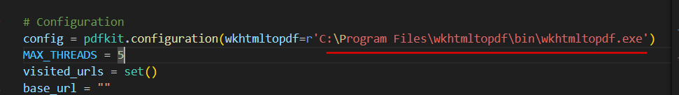

# Downloading a website/website prerequisites
1. Need to downloade  python and set the path to environment vairables
2. Need to downloade [wkhtmltopdf](https://wkhtmltopdf.org/downloads.html)  
3. There are 3 optoin for dowloading 1.pdf 2.docx 3.html \
Note: add the wkhtmltopdf also to the environment vairabiles
4. install pip 
>pip install requests pdfkit python-docx beautifulsoup4
5. run the command 

Note: Make sure to specify the correct path of wkhtmltopdf before running the code in my case it is as below in the python code.

Thankyou